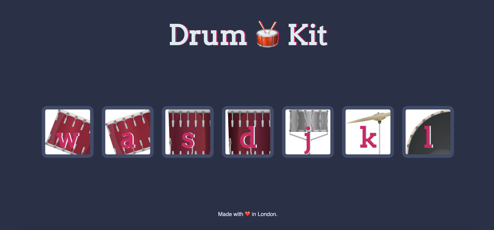

# Drum Kit Code Along

## Description:

This is the Drum Kit Code Along Project from Udemy's, The Complete 2022 Web Development Bootcamp, taught by Dr. Angela Yu. This is my second JavaScript Project and the first time I stuck strictly to the curriculum. In this code along there are seven boxes with seven different Instruments within the boxes. Within each box are the following letters: w, a, s, d, j, k, l. If you use your mouse to click on any of the boxes, a sound, that correlates with the image, will play, a box shadow will display for .5 seconds, and then the image will reset to how it originally appeared. The above letters also correlate to the letters on the keyboard, and when pressed, will perform the same results as clicking on the individual images. This can be done as many times as the user wants.

## What I Learned:

1. How to add eventListeners to a button and keydown's.
2. Higher Order Functions and Passing Functions as Arguments.
3. How to play Audio files on a webpage.
4. Learned how to make a Constructor Function and Initialize an Object.
5. How to incorporate Switch Statements within code.
6. What are, and how to make, anonymous functions.
7. Adding Methods within Objects and utilizing Dot Notation.
8. Lastly how to add some animation to each button.

Drum Kit Code Along Project 👉🏽 https://coderortiz.github.io/drum-kit/

